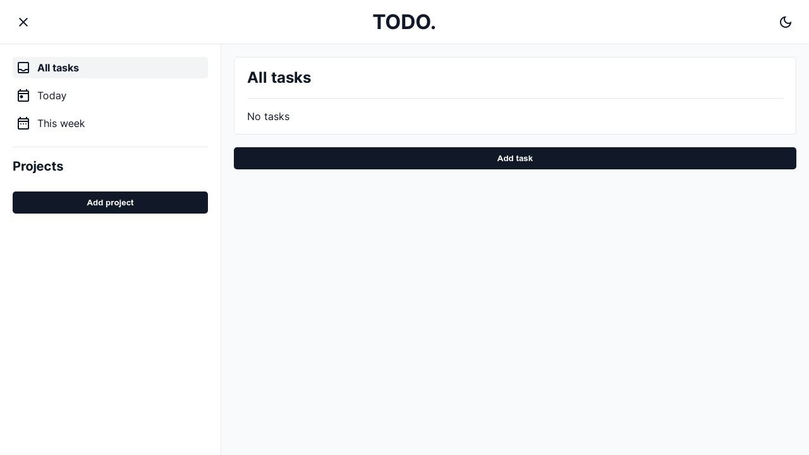
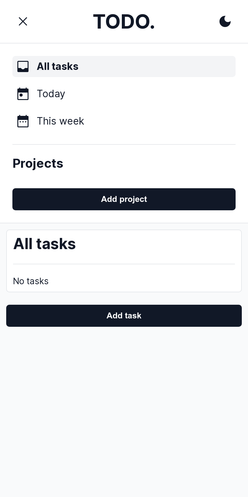

# Todo list
### About the project
Regular Todo-list web project that you can keep track of tasks, also edit them by date, name, mark them as done, and delete them. Store tasks in different projects. All data are saved in localStorage.

Desktop screenshot

  <ol>
    
  </ol>

  
Mobile screenshot

  <ol>
    
  </ol>

### [Live preview](https://liudasbo.github.io/todo/)

---
### Built With
* HTML
* SCSS
* JavaScript
* Webpack
* date-fns
---
### Resources
* Icons was provided by [Material Symbols](https://fonts.google.com/icons)